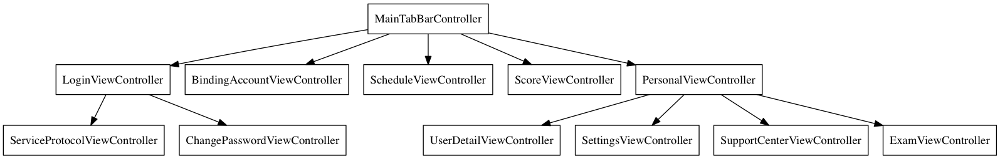

The Educational Administration System Client of Xiamen University Tan Kah Kee College

[](https://travis-ci.com/luckytianyiyan/XujcIOSClient)
[](http://www.gnu.org/licenses/gpl-3.0.html)
GetStart
---
XujcClient uses [CocoaPods](http://cocoapods.org/) to install and manage dependencies. Open a terminal window and navigate to the location of the Xcode project.

```
$ cd XujcClient
$ pod install
```

This creates an `XujcClient.xcworkspace` file. Use this file for all future development.

Dependencies
---
### Frameworks
- [ReactiveCocoa](https://github.com/ReactiveCocoa/ReactiveCocoa)
- [Masonry](https://github.com/SnapKit/Masonry)
- [luckytianyiyan/AFNetworking (branch: ty_no_unescaped_ctrl_char)](https://github.com/luckytianyiyan/AFNetworking/tree/ty_no_unescaped_ctrl_char)
- [SDWebImage](https://github.com/rs/SDWebImage)
- [FMDB](https://github.com/ccgus/fmdb)

### Services
- [Instabug](https://github.com/Instabug/Instabug-iOS.git)
- [AliyunOSSiOS](https://github.com/aliyun/aliyun-oss-ios-sdk)
- [Google/Analytics](https://www.google.com/analytics/)

### Other
- [SSKeychain](https://github.com/soffes/sskeychain)
- [MBProgressHUD](https://github.com/jdg/MBProgressHUD)
- [TTTAttributedLabel](https://github.com/TTTAttributedLabel/TTTAttributedLabel)
- [UIColor-HexString](https://github.com/kevinrenskers/UIColor-HexString)
- [CupertinoYankee](https://github.com/mattt/CupertinoYankee)
- [DZNEmptyDataSet](https://github.com/dzenbot/DZNEmptyDataSet)
- [MMPopupView](https://github.com/adad184/MMPopupView)
- [MJRefresh](https://github.com/CoderMJLee/MJRefresh)

ViewControllers
---


License
---
`XujcClient` is available under the GPLv3 license. See the LICENSE file for more info.
